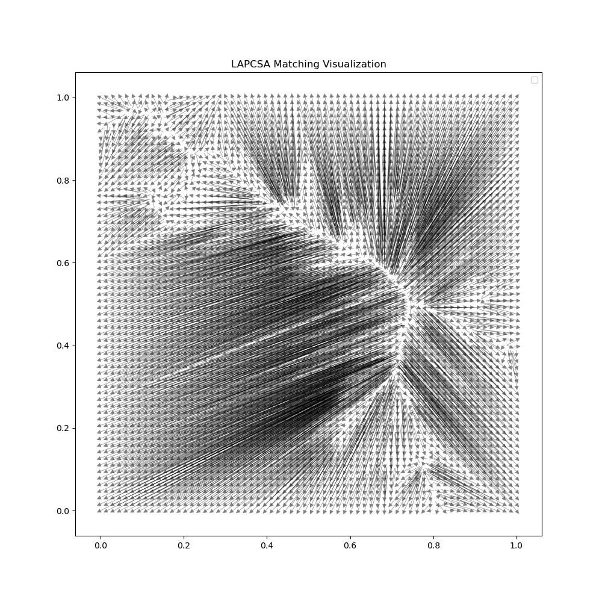

# lapcsa

Python wrapper for [CSA](https://github.com/rick/CSA) from Andrew V. Goldberg's Network Optimization Library.



## Installation

```bash
pip install lapcsa
```

## Cost Matrix Usage

```python
import numpy as np
import lapcsa

# Create a cost matrix (must be square)
n = 3
cost_matrix = np.array([
    [4, 1, 3],
    [2, 0, 5],
    [3, 2, 2]
], dtype=np.float64)

# Solve the assignment problem
cost, row_assignments, col_assignments = lapcsa.lap(cost_matrix)
```

# Point Matching Usage

```python
import numpy as np
import lapcsa

# For Euclidean bipartite matching between point sets
points1 = np.array([[0, 0], [1, 1], [2, 2]])
points2 = np.array([[0, 1], [1, 2], [2, 1]])

# Find minimum cost matching between point sets
cost, assignments1, assignments2 = lapcsa.ebm(points1, points2)
```